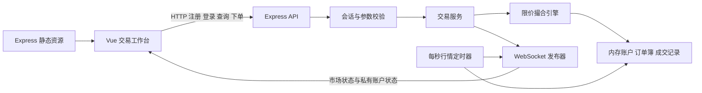

# 股票模拟交易系统详细实现文档

版本：v1.9  
日期：2026-09-06  
状态：T01～T07 已完成；T08 本地交付整理完成。干净源码副本的 npm ci、553 项完整检查及生产入口验收通过，纯生产依赖运行通过；README、Prompt 整理版和交付清单已整理。Docker 实际镜像构建、健康检查、交易及 WebSocket 验收通过；公开仓库为空，尚未提交推送。详见 [交付验收与清单.md](交付验收与清单.md)

题目来源：[股票模拟交易系统编程题目.md](股票模拟交易系统编程题目.md)。原文件保持不变，本文将题目要求转化为可执行的开发方案。

本文定义完整应用的实现目标；当前已完成 T01 工程骨架、T02 内存与身份、T03 同步撮合核心、T04 交易 API、T05 前端工作台、T06 实时链路和 T07 幂等与故障恢复。页面已支持真实限价买卖、每秒行情、双方资产及历史记录自动更新，断线后通过完整快照恢复；结果不明的下单保留原请求标识，可在同一标签页刷新后显式确认。实际运行方式以 README 为准，各阶段测试过程见对应验收文档。题目中的提交邮件、发布公开仓库等文字属于题目背景与未来交付要求，未经用户授权不执行这些操作。

## 1. 目标、范围与需求追踪

### 1.1 最终交付目标

完成一个可以本地运行的股票模拟交易 Web 应用：用户注册后获得 1,000,000 虚拟币，查看至少三只股票的模拟行情，提交限价买卖委托，观察撮合结果，以及资金、持仓和成交记录的实时变化。

所有业务状态保存在同一个 Node.js 进程的内存中，重启后清空。系统应能用两个独立浏览器会话演示真实的委托撮合，并能解释订单排序、资金冻结、成交结算和断线恢复的实现。

### 1.2 原题必做项与落地方式

| 编号 | 原题要求 | 本方案实现 | 验收入口 |
| --- | --- | --- | --- |
| R01 | Vue 3 + TypeScript 前端 | Vite、Composition API、单文件组件 | 前端代码与构建 |
| R02 | 登录、注册；内存存储 | 用户表、密码摘要、内存会话 | 注册页、登录页、鉴权接口 |
| R03 | 至少三只股票，包含代码、名称、最新价、涨跌幅 | 固定三只虚拟股票、服务端统一计算涨跌幅 | 行情看板 |
| R04 | 价格每秒随机小幅波动 | 服务端单个 1 秒定时器统一生成行情 | 两个窗口对比行情 |
| R05 | 选择股票，输入价格、数量，买入或卖出 | 限价委托表单、服务端校验 | 交易面板与下单 API |
| R06 | 当前用户委托列表与持仓列表 | 展示未成交、部分成交、已成交及持仓 | 交易工作台 |
| R07 | 最近成交记录：股票、价格、数量、时间 | 个人成交与匿名市场成交两个视图 | 成交记录区 |
| R08 | Node.js + Express / Fastify；RESTful API | Node.js + TypeScript + Express | API 集成检查 |
| R09 | 后端提供静态页面入口 | 构建后由 Express 托管前端产物 | 仅启动后端即可访问页面 |
| R10 | 内存限价撮合，价格优先、时间优先；更新资金与持仓 | 独立撮合引擎、冻结与原子结算 | 引擎测试与双用户演示 |
| R11 | 初始资金统一 100 万；用户、订单簿、成交均内存维护 | 新用户 100,000,000 分；单进程 Map | 注册资产、重启清空检查 |
| R12 | WebSocket 或 SSE 推送行情及用户委托、持仓、成交 | WebSocket 推送市场状态和用户账户状态 | 无刷新更新、用户隔离检查 |
| R13 | README、公开源码仓库、3～5 条关键 Prompt 记录 | 实现后补齐 README 和协作案例记录 | 最终交付检查表 |

### 1.3 附加项与实现优先级

原题把 Docker、撮合单元测试、WebSocket 重连列为附加挑战。本文建议尽早实现撮合测试，因为它直接帮助保证资金正确性，但不将其描述为原题必做要求。按用户追加的开发约定，本项目所有新功能均必须先写充分的测试并确认失败，再实现代码，最后做测试验收；这一开发约定也适用于撮合引擎。

| 优先级 | 内容 | 完成时机 |
| --- | --- | --- |
| P0 | 原题功能、参数校验、资金与持仓冻结、用户隔离、可启动的构建产物 | 最小可交付版本 |
| P1 | 撮合单元测试、断线重连及快照恢复、下单幂等 | 引擎测试、断线重连与下单幂等均已完成 |
| P2 | Docker、用户撤单、更多订单簿深度展示、界面细节 | 核心验收通过后 |

第一版不引入数据库、Redis、微服务、真实证券行情、手续费、分红、融资融券、市场单、K 线分析或真实交易所规则。股票代码、行情和资产均为虚拟演示数据。

### 1.4 原题未规定的规则：本方案的明确选择

以下均为实现决策，不是对题目原文的补充要求。

| 问题 | 本方案约定 | 原因 |
| --- | --- | --- |
| 如何决定成交价 | 使用已在订单簿中等待的对手订单价格 | 双方限价都能满足，规则容易验证 |
| 是否支持部分成交 | 支持；剩余数量继续挂单 | 撮合过程完整，也覆盖附加测试场景 |
| 数量单位 | 正整数股，最小 1 股 | 原题未要求 100 股整手规则 |
| 买卖限制 | 不透支、不做空；买入后可立即卖出 | 简化演示，不模拟 T+1 |
| 委托有效期 | 留在内存订单簿中，直到成交、撤销或服务重启 | 无需交易日及到期逻辑 |
| 行情与成交价关系 | 行情是独立随机参考价；交易只依赖真实委托交叉 | 避免随机行情越过限价就凭空成交 |
| 初始股票从哪里来 | 系统演示账户持有初始化库存，并预置有限买卖挂单 | 新用户没有持仓也能完成首笔买入 |
| 是否允许自己与自己成交 | 不允许；提交前预演撮合，若会自成交则整笔拒绝 | 避免刷成交及结算歧义 |
| 最近成交属于谁 | 默认个人成交；另提供脱敏市场成交 | 同时支持账户核对和市场观察 |

## 2. 技术选型与总体架构

### 2.1 技术栈

| 层次 | 选择 | 使用范围 |
| --- | --- | --- |
| 工程组织 | npm workspaces | 前端、后端、共享契约三个包 |
| 运行时 | Node.js 22.14+（22.x）或 24.x | 工程沿用现有 WSL Node.js 22.14.0，.nvmrc 固定该版本；依赖已按兼容范围选择 |
| 前端 | Vue 3、TypeScript、Vite | 页面和构建；使用 script setup |
| 页面与状态 | Vue Router、Pinia | 登录路由、账户状态、行情状态 |
| 后端 | Express、TypeScript | HTTP 接口、静态资源、业务编排 |
| 实时通信 | 服务端 ws，浏览器原生 WebSocket | 行情广播、用户私有状态推送 |
| 参数验证 | Zod | 对外输入的运行时校验 |
| 测试 | Vitest；Supertest 用于 HTTP 集成测试 | 引擎、结算和核心 API |
| 代码质量 | ESLint、Prettier、tsc、vue-tsc | 格式、静态检查、Vue 类型检查 |

不在设计文档中锁死所有依赖的小版本；搭建时统一选择兼容版本并提交 `package-lock.json`。Vue 官方提供 Vite + TypeScript 的初始化路径；Vite 的转译不替代类型检查，因此构建流程需要独立执行 `vue-tsc`。[Vue 快速开始](https://vuejs.org/guide/quick-start)、[Vue TypeScript 指南](https://vuejs.org/guide/typescript/overview)。

### 2.2 架构关系



三条主要架构决策，可在最终 README 中简写：

1. **同一个 Node.js 进程维护唯一状态。** HTTP 下单、行情定时器、实时推送共享同一个内存存储，避免各自生成互不一致的数据。
2. **撮合和结算形成独立业务模块。** 路由处理身份、参数和响应；排序、成交计划、资金校验与变更放在可以独立测试的模块中。
3. **HTTP 负责命令，WebSocket 负责状态同步。** 下单有明确成功或失败响应；推送携带版本和完整可见状态，便于首次加载与恢复。

第一版只启动一个后端实例，不能直接扩展为多个进程或副本：多个独立内存会导致订单簿和账户分裂。若需扩容，必须重新设计状态归属和持久化。

## 3. 目录与模块职责

以下是完整应用的目标结构。T01～T07 已实现工程配置、共享契约、内存身份、撮合结算、交易 API、前端工作台、实时链路与幂等恢复。前端使用 HomeView、AuthView（按路由区分登录/注册）和 NotFoundView；工作台拆分 AccountSummary、MarketBoard、OrderForm、PositionTable 和 TradingHistory 组件。实时链路由 server 的 market.service / realtime.service、client 的 realtime store 与事件校验器承载；幂等索引由 memory-store 和交易服务维护；前端 pending-order 服务负责当前标签页的恢复记录。

```text
stock-project/
├── README.md
├── package.json
├── package-lock.json
├── tsconfig.base.json
├── .nvmrc
├── .env.example
├── .gitignore
├── docs/
│   ├── 股票模拟交易系统编程题目.md
│   ├── 股票模拟交易系统详细实现文档.md
│   └── AI协作记录.md
├── apps/
│   ├── client/
│   │   ├── package.json
│   │   ├── vite.config.ts
│   │   ├── tsconfig.json
│   │   └── src/
│   │       ├── main.ts
│   │       ├── App.vue
│   │       ├── router/index.ts
│   │       ├── views/{LoginView,RegisterView,TradingView}.vue
│   │       ├── components/
│   │       │   ├── MarketBoard.vue
│   │       │   ├── AccountSummary.vue
│   │       │   ├── OrderForm.vue
│   │       │   ├── OrderTable.vue
│   │       │   ├── PositionTable.vue
│   │       │   ├── TradeTable.vue
│   │       │   └── ConnectionStatus.vue
│   │       ├── stores/{auth,market,account}.ts
│   │       ├── services/{http,socket}.ts
│   │       ├── composables/useRealtime.ts
│   │       └── utils/{money,time}.ts
│   └── server/
│       ├── package.json
│       ├── tsconfig.json
│       └── src/
│           ├── index.ts
│           ├── app.ts
│           ├── config.ts
│           ├── routes/{auth,stocks,account,orders,trades}.ts
│           ├── middleware/{auth,error,validate}.ts
│           ├── domain/{order,account,trade}.ts
│           ├── services/{auth,trading,market}.service.ts
│           ├── matching/{engine,order-book,settlement}.ts
│           ├── store/{memory-store,seed}.ts
│           ├── realtime/{server,publisher,snapshots}.ts
│           └── tests/
│               ├── engine.test.ts
│               ├── settlement.test.ts
│               ├── orders.api.test.ts
│               └── realtime.test.ts
├── packages/shared/
│   ├── package.json
│   ├── tsconfig.json
│   └── src/{index,dto,events,errors,constants}.ts
├── Dockerfile                 # P2
└── docker-compose.yml         # P2
```

模块边界：

- `app.ts` 创建 Express 应用，不监听端口、不启动定时器，方便测试。
- `index.ts` 负责种子数据、监听 HTTP、挂载 WebSocket、启动定时器及退出清理。
- `memory-store.ts` 管理 Map 和索引，不承载 HTTP 对象或 Vue 状态。
- `engine.ts` 负责候选订单选择和成交计划；`settlement.ts` 负责账户算术和不变量检查。
- `trading.service.ts` 串联校验、冻结、撮合、结算、提交和发布，不直接向浏览器发送内部对象。
- `snapshots.ts` 构造脱敏 DTO；REST 和 WebSocket 复用它，避免字段语义不一致。
- `packages/shared` 仅包含公开 DTO、事件与常量；密码摘要、会话、内部对手方信息留在服务端。

## 4. 业务规则与演示数据

### 4.1 用户、身份与初始资产

- 注册用户名去除两端空白后规范化为小写，规则为 3～20 位英文字母、数字或下划线；规范化后的名称唯一。
- 密码 8～64 个字符，不保存明文。使用随机盐与异步 `crypto.scrypt`，比较摘要使用 `timingSafeEqual`。盐长度至少 16 字节。实现参数参考 [Node.js Crypto 文档](https://nodejs.org/api/crypto.html#cryptoscryptpassword-salt-keylen-options-callback)。
- 注册时创建用户与账户：`cashBalanceCents = 100_000_000`、`frozenCashCents = 0`、持仓为空。
- 密码摘要计算完成后，在同步提交用户前再次检查用户名唯一性，避免并行注册重复创建用户。
- 注册成功自动登录。登录创建随机会话，保存在 `Map<sessionId, Session>`，有效期约定为 24 小时。
- 同一前端 Pinia 会话中的登录、注册、退出操作互斥；提交期间阻止离开认证页。互斥持续到私有快照请求全部结束，失败或会话过期后也必须解除处理中状态；本地代次检查不能代替 Cookie 写请求互斥。
- 浏览器使用 `HttpOnly`、`SameSite=Lax`、`Path=/` 的会话 Cookie；HTTPS 环境启用 `Secure`，本地 HTTP 开发环境不设置 `Secure`。
- 所有账户和交易操作从会话取得 `userId`，不接受请求体中指定其他用户。
- 退出登录删除会话并关闭此会话关联的 WebSocket；会话过期同样停止私有推送。
- 后端重启后旧 Cookie 不再对应有效会话，前端清空账户状态并返回登录页。

### 4.2 股票与模拟行情

| 代码 | 名称 | 初始参考价 | 固定昨收基准 |
| --- | --- | --- | --- |
| SIM001 | 星河科技 | 10.00 | 10.00 |
| SIM002 | 远航制造 | 20.00 | 20.00 |
| SIM003 | 青禾能源 | 30.00 | 30.00 |

价格以整数分保存。服务端每秒对每只股票生成一个非零变化比例，例如从 `[-20, -1] ∪ [1, 20]` 个基点中随机抽取，即约 ±0.01%～±0.20%。计算四舍五入后的分数；若变化量为 0，则按方向调整 1 分，最低保持 1 分，最高遵守价格上限。

```text
deltaCents = round(lastPriceCents × randomBps / 10_000)
nextPriceCents = clamp(lastPriceCents + nonZero(deltaCents), 1, MAX_PRICE_CENTS)
changePercent = (nextPriceCents - previousCloseCents) / previousCloseCents × 100
```

`nonZero` 在四舍五入结果为 0 时使用原始 `randomBps` 的符号。`previousCloseCents` 在一次服务运行中固定；不按上一秒价格计算涨跌幅。涨跌幅可以使用浮点并格式化为两位小数；结算金额全部使用整数。极低价格下受最小 1 分单位影响，实际百分比可能超出目标区间；处于价格边界时允许当次价格不变。

页面将其标为“模拟最新价”，订单簿参考价格标为“最佳买价 / 最佳卖价”。随机报价变化不会产生交易、修改现金或修改持仓数量。只有买卖委托交叉才生成成交；报价变化可改变前端计算的持仓市值。

### 4.3 初始流动性：保证演示能成交

若所有用户都只有现金、没有股票，严格限制做空后就没有第一笔卖单。为此增加一个不可通过公开登录接口登录的 `SYSTEM` 演示账户：

1. 系统账户初始现金同样是 1,000,000 虚拟币，每只股票初始化 10,000 股库存；这些库存是演示股票的初始发行来源。
2. 服务启动时，每只股票分别挂 1,000 股买单和 1,000 股卖单，价格为初始参考价减 1 分和加 1 分。
3. 种子委托通过同一交易服务入簿，执行正常资金和持仓冻结，不向普通用户伪造成交。
4. 此后不会自动补充现金、库存或重置挂单。挂单消耗后由用户继续撮合；界面显示流动性不足或暂无对手盘。
5. `ENABLE_DEMO_LIQUIDITY=false` 可关闭种子挂单，便于用户间撮合演示和测试。服务无公开重置接口；恢复初始演示数据需要重启本地服务。

三只股票的种子买单合计冻结 `999×1000 + 1999×1000 + 2999×1000 = 5,997,000` 分，未超过系统账户初始现金。卖单各冻结 1,000 股，未超过库存。初始最优买卖价相差 2 分，不会彼此成交。

这是有限的演示流动性，不是按随机行情自动交易的机器人。新用户可参考最佳卖价买入，再参考最佳买价卖出。单元测试自行构造账户、库存和订单，禁用随机行情与默认种子挂单。

## 5. 数据模型与内存存储

### 5.1 核心类型

以下是领域模型示意。金额和数量都必须经过运行时校验，TypeScript 的 `number` 类型本身不保证其为整数。

```ts
type Side = 'BUY' | 'SELL';
type OrderStatus = 'OPEN' | 'PARTIALLY_FILLED' | 'FILLED' | 'CANCELLED';

interface User {
  id: string;
  username: string;
  passwordHash: string;
  passwordSalt: string;
  kind: 'USER' | 'SYSTEM';
  createdAt: string;
}

interface Account {
  userId: string;
  cashBalanceCents: number; // 总现金，包含冻结部分
  frozenCashCents: number;
  version: number;          // 此用户每次原子状态提交递增一次
}

interface Position {
  userId: string;
  symbol: string;
  quantity: number;         // 总持仓，包含冻结部分
  frozenQuantity: number;
}

interface Order {
  id: string;
  userId: string;
  symbol: string;
  side: Side;
  priceCents: number;
  quantity: number;
  filledQuantity: number;
  executedValueCents: number;
  status: OrderStatus;
  sequence: number;         // 服务端接单序号，决定同价先后
  createdAt: string;
  updatedAt: string;
}

interface Trade {
  id: string;
  sequence: number;
  symbol: string;
  priceCents: number;
  quantity: number;
  buyOrderId: string;
  sellOrderId: string;
  buyerUserId: string;
  sellerUserId: string;
  executedAt: string;
}

interface StockQuote {
  symbol: string;
  name: string;
  previousCloseCents: number;
  lastPriceCents: number;
  changePercent: number;
  bestBidCents: number | null;
  bestAskCents: number | null;
  updatedAt: string;
}
```

首版不维护持仓成本和已实现盈亏，避免引入原题未要求的成本分摊规则。账户面板展示可用现金、冻结现金、持仓市值和总资产；总资产为总现金加按模拟价计算的持仓市值，不能把冻结现金重复相加。

### 5.2 索引布局

| 存储 | 结构 | 作用 |
| --- | --- | --- |
| 用户 | 用户 ID Map；规范化用户名到 ID 的 Map | 身份与登录查询 |
| 会话 | `Map<sessionId, { userId, expiresAt }>` | HTTP / WebSocket 鉴权 |
| 账户 | `Map<userId, Account>` | 资金与账户版本 |
| 持仓 | `Map<userId, Map<symbol, Position>>` | 持仓与冻结数量 |
| 委托 | 订单 ID Map；用户订单 ID 索引 | 查询和历史展示 |
| 订单簿 | 每股票的买单 ID 数组、卖单 ID 数组 | 仅保存有可成交剩余量的订单 |
| 成交 | 内部成交 Map、市场成交 ID 序列、用户成交 ID 索引 | 市场与个人成交查询 |
| 行情 | `Map<symbol, StockQuote>` | 三只股票统一报价 |
| 幂等键 | idempotentOrdersByUser：用户 → 小写 UUID → orderId 与请求指纹 | T07 已实现；成功记录保留到服务重启 |
| 连接 | `Map<sessionId, Set<WebSocket>>` | 多标签页推送与退出清理 |

使用数组排序足以支撑此题规模。插入后排序上界约为 `O(n log n)`，扫描成交约为 `O(n)`；代码清晰性优先。若使用 `shift/splice` 逐笔删除，会增加搬移成本，首版可扫描后统一过滤移除。

全部历史数据保留到服务重启，列表接口分页，推送只包含可见窗口。默认最多每用户 100 条活跃委托、全市场 5,000 条活跃委托，超限拒绝新增，以约束数组扫描和消息大小。长期运行时历史 Map 仍会增长，这是演示版限制；不盲目清理仍被订单、成交或幂等索引引用的数据。

## 6. 撮合引擎与结算

### 6.1 输入限制和资金单位

- API 接受整数 `priceCents`，不接受 `10.01` 这种以元表示的价格字段。
- 前端将最多两位小数的价格字符串按整数部分、小数部分解析为分，避免直接 `Number(value) * 100` 引入浮点误差。
- 价格范围为 `1..10_000_000` 分，数量范围为 `1..100_000` 股；不接受 0、负数、小数数量、非有限值或未知股票。
- 验证价格、数量及乘积的 `Number.isSafeInteger`；草稿结算后的每一次加减同样验证安全整数与余额约束。
- 最大单笔名义金额为 `10_000_000 × 100_000 = 10^12` 分，仍在安全整数范围内；实际下单还必须满足资金或持仓要求。
- ID 和时间由服务端产生。时间统一使用 UTC ISO 8601 字符串，页面按用户本地时区展示。

### 6.2 排序与可成交条件

| 订单簿 | 第一排序键 | 第二排序键 |
| --- | --- | --- |
| 买盘 | 委托价从高到低 | sequence 从小到大 |
| 卖盘 | 委托价从低到高 | sequence 从小到大 |

接到买单时，依次检查最低卖价，只要 `buy.priceCents >= sell.priceCents` 就可以成交。接到卖单时，依次检查最高买价，使用相同交叉条件。最优对手价已不满足限价时立即停止，不能跳过它继续找更差价格。

同价先后只看服务端成功接单时分配的单调递增序号；两个请求处于同一毫秒仍能稳定排序。部分成交后留簿的订单保留原始序号，不重新排到队尾。不同股票分别撮合。

每笔成交数量是买卖双方剩余数量的较小值。成交价格是该次被匹配的已有挂单价格，即 `maker.priceCents`，而不是随机行情价、买卖中间价或固定使用卖方价格。

### 6.3 下单冻结

可用现金与可用持仓是派生值：

```text
availableCashCents = cashBalanceCents - frozenCashCents
availableQuantity = quantity - frozenQuantity
```

买入 Q 股、限价 L 分：先验证可用现金不少于 `L × Q`，再增加同等冻结现金，总现金不变。卖出 Q 股：验证可用持仓不少于 Q，增加冻结持仓，总持仓不变。

即使预计会立即以更低价格成交，也先按买单完整限价金额校验资金，避免不同成交路径采用不同的可买规则。

### 6.4 每笔成交如何结算

设买单限价为 L，实际成交价为 P，本笔数量为 Q；根据撮合条件有 `P <= L`。

| 对象 | 变更 |
| --- | --- |
| 买方总现金 | `cashBalanceCents -= P × Q` |
| 买方冻结现金 | `frozenCashCents -= L × Q` |
| 买方总持仓 | `position.quantity += Q` |
| 卖方总现金 | `cashBalanceCents += P × Q` |
| 卖方总持仓 | `position.quantity -= Q` |
| 卖方冻结持仓 | `position.frozenQuantity -= Q` |
| 双方订单 | 已成交量增加 Q；成交金额累计增加 P × Q |
| 成交表 | 记录双方订单、价格、数量和服务端时间 |

买方的价差 `（L - P）× Q` 随冻结金额减少而自动回到可用现金，不再额外增加总现金，否则会凭空创造资金。买方新获得的股票可以立即用于新的卖单。

部分成交的剩余买单继续冻结 `limitPriceCents × remainingQuantity`；剩余卖单继续冻结未成交股数。新卖单匹配更高限价的已有买单时，按已有买单价格结算，卖方也可能获得优于自身限价的成交价。

### 6.5 订单状态与撤单

```text
未成交留簿                     -> OPEN
0 < filledQuantity < quantity  -> PARTIALLY_FILLED
filledQuantity = quantity     -> FILLED
撤销剩余未成交部分              -> CANCELLED（P2）
```

页面将 OPEN、PARTIALLY_FILLED 放入“未完成”分组，FILLED 放入“已成交”分组；部分成交显示“已成交 / 委托数量”。CANCELLED 虽然保留在模型中，但 P2 撤单实现前不提供此状态的操作入口。

P2 撤单只取消未成交余量，保留历史成交。买单释放 `priceCents × (quantity - filledQuantity)` 冻结资金，卖单释放相应冻结股数，移出订单簿。重复撤销已撤订单返回当前状态；已全部成交的订单返回冲突。撤单与下单通过同一个同步交易服务提交，不会同时释放或成交同一余量。

### 6.6 原子性、自成交与处理步骤

“Node.js 单线程”只保证同一同步调用栈不会被另一个事件回调插入，不能自动为含 await 的业务提供事务，也不能自动回滚异常。提交过程采用“预演、草稿、检查、一次提交”。

```text
submitLimitOrder(authenticatedUser, input):
  1. 校验身份和输入格式；公开请求要求 UUID，先检查已有成功请求
  2. 对新的下单请求校验股票、价格、数量、活跃订单上限
  3. 读取已排序对手盘，预演直到数量满足或不再交叉
  4. 若实际将匹配到自己的挂单，整笔拒绝；不跳过自有订单
  5. 在受影响账户、持仓、订单、订单簿的草稿中校验并冻结
  6. 按预演顺序计算成交、结算、状态和剩余入簿
  7. 校验草稿中的安全整数、余额、持仓和守恒不变量
  8. 同步提交全部变更，写入成交、索引与成功幂等键
  9. 每个受影响用户的 accountVersion 递增一次
 10. 生成账户和市场快照，发送 HTTP 响应并安排 WebSocket 推送
```

步骤 1 中完成输入规范化后，到步骤 9 提交结束，不允许 await、外部 I/O 或异步回调；草稿不得持有会被提前改写的原对象引用。提交后发送失败不回滚已完成交易，客户端通过查询或重连恢复。内部错误由统一异常处理捕获，不能出现“买方已扣钱、卖方未到账”的半次提交。

幂等命中检查必须早于当前资产和活跃订单上限检查，否则第一次已成功的请求可能在重试时因为资产变化被误拒绝。命中后先比较原始规范化业务参数，再返回原订单和当前账户快照。

自成交检查仅覆盖本次限价及数量实际会走到的路径。外部卖单已满足数量时，更后面的自有卖单不影响本次下单；若满足数量前遇到自己，则返回 SELF_TRADE_PREVENTED，此前预演的外部成交也不提交。

### 6.7 必须保持的不变量

每次成功下单、成交或撤单后应成立：

1. `cashBalanceCents >= frozenCashCents >= 0`。
2. `position.quantity >= position.frozenQuantity >= 0`。
3. `0 <= filledQuantity <= quantity`；已成交、已撤订单不在活跃订单簿。
4. 用户冻结现金等于其所有活跃买单的 `priceCents × remainingQuantity` 之和。
5. 用户某股票的冻结持仓等于其该股票所有活跃卖单剩余数量之和。
6. 单次交易前后，包含系统账户在内的全体总现金不变、每种股票总股数不变。注册发放现金、启动发行演示库存是独立初始化动作，不混入交易守恒断言。
7. 一笔成交对买卖双方的已成交量增量相等，且金额相等。
8. 撮合完成后，同一股票的最佳买价严格低于最佳卖价，或其中一侧为空。

### 6.8 可以手算核对的案例

关闭默认种子流动性，测试账户具备足够资产，订单依次为：

| 顺序 | 用户 | 委托 | 价格 | 数量 |
| --- | --- | --- | --- | --- |
| 1 | A | 卖出 SIM001 | 10.00 | 100 |
| 2 | B | 卖出 SIM001 | 9.80 | 50 |
| 3 | C | 买入 SIM001 | 10.20 | 120 |

预期先成交 B 的 50 股，再成交 A 的 70 股，体现价格优先于提交时间。两笔成交价分别为 9.80 和 10.00，合计 `49,000 + 70,000 = 119,000` 分。

C 最初冻结 `1,020 × 120 = 122,400` 分，实际现金减少 119,000 分，价差 3,400 分恢复可用，冻结归零，持仓增加 120 股。B 的订单全部成交；A 留下 30 股卖单，仍冻结 30 股。

另一个独立用例：若 C 买入 200 股，则仅成交 150 股，总支出 149,000 分，余下 50 股买单以 10.20 留簿，继续冻结 51,000 分。

### 6.9 T03 已实现入口与验收

`createTradingService(store, options?).submitOrder(userId, input)` 是公开 API 使用的同步入口，要求 clientOrderId；`submitLimitOrder` 为可信内部入口，系统种子和引擎测试可省略标识。两者共用撮合实现，同步返回内部订单、成交、受影响用户 ID、市场版本及 replayed。支持注入活跃单上限，默认每用户 100 条、全市场 5,000 条。命中成功幂等键时先比对业务参数，再返回最新订单，跳过资产、活跃单上限和撮合；原子性不变量保持不变。

撮合模块位于 `apps/server/src/matching/`；订单、订单簿和成交索引已接入内存，账户快照已返回真实委托和个人成交。T04 必须从会话提取用户 ID，并使用公开 DTO，不能将含双方内部身份的服务返回值直接发给客户端。启动种子挂单也在 T04 通过同一服务执行。

T03 先写四个测试文件，确认模块缺失导致红灯，再实现代码；新增 87 个测试全部通过，全量 182 个测试及 typecheck、lint、format、build 通过。具体覆盖和手算结果见 [撮合核心实现验收.md](撮合核心实现验收.md)。

## 7. REST API 契约

### 7.1 通用约定

API 前缀 `/api`，JSON 编码。除注册、登录和健康检查外均需登录。页面只传业务参数，不传用户身份字段。查询列表默认 limit=50，最大 100，使用服务端序号作为游标；最新记录优先，返回 nextCursor，无下一页时为 null。

成功与错误包络：

```json
{ "data": { "id": "order_example" } }
```

```json
{
  "error": {
    "code": "INSUFFICIENT_FUNDS",
    "message": "可用资金不足",
    "details": { "requiredCents": 102000, "availableCents": 100000 }
  },
  "requestId": "req_example"
}
```

### 7.2 接口清单

| 方法与路径 | 输入 | 返回或用途 |
| --- | --- | --- |
| POST /api/auth/register | username, password | 201；用户公开信息，设置会话 Cookie |
| POST /api/auth/login | username, password | 200；用户公开信息，设置会话 Cookie |
| POST /api/auth/logout | 无 | 204；清理会话与对应连接 |
| GET /api/auth/me | 无 | 当前用户与服务实例标识 |
| GET /api/stocks | 无 | serverEpoch, marketVersion, quotes |
| GET /api/stocks/:symbol/orderbook | depth，默认 5、最大 20 | P2 深度展示；价格档位与剩余总量 |
| GET /api/me/snapshot | 无 | 与 WS 私有快照一致的账户、持仓、订单和近期成交 |
| GET /api/me/account | 无 | 总现金、冻结现金、可用现金、账户版本 |
| GET /api/me/positions | 无 | 本人持仓总量、冻结数量、可用数量 |
| GET /api/me/orders | status?, symbol?, cursor?, limit? | 本人订单分页 |
| POST /api/orders | symbol, side, priceCents, quantity, clientOrderId（UUID，必填） | 首次 201，重放 200；最新订单和当前本人快照 |
| GET /api/me/trades | symbol?, cursor?, limit? | 本人成交，含本人方向和本人订单 ID |
| GET /api/trades | symbol?, cursor?, limit? | 匿名市场成交，不含用户和订单 ID |
| DELETE /api/orders/:id | 无 | P2；撤销本人未成交余量，返回本人快照 |
| GET /api/health | 无 | 200；服务状态，不暴露会话或账户 |

公开价格档位不返回其他用户身份。基础版本通过 stocks 中的 bestBidCents / bestAskCents 显示最佳买卖价即可；没有对手盘时为 null，页面显示“暂无”，不使用 0 误导下单。

### 7.3 下单示例与重复提交（T07 已实现）

```json
{
  "symbol": "SIM001",
  "side": "BUY",
  "priceCents": 1001,
  "quantity": 100,
  "clientOrderId": "7d8dfe84-cc8d-4cc6-9f5f-55b6c6a57279"
}
```

当前公开请求严格接受上述五个字段；clientOrderId 必须是 UUID，缺失或格式错误返回 400，大小写统一为小写。userId 等额外字段被拒绝。股票代码和方向仍按既有规则精确匹配。

下单被接受不等于全部成交，响应内订单状态可能为 OPEN、PARTIALLY_FILLED 或 FILLED。响应包含 serverEpoch 和 accountVersion，前端必须走与推送相同的版本校验入口，不能用较旧 HTTP 响应覆盖较新推送。

T07 幂等规则：客户端一次提交生成一个 UUID；超时重试复用它。同一用户、同一键、同一规范化业务参数返回同一个订单的当前状态，不再次冻结或撮合，HTTP 返回 200；同一键但不同参数返回 409。键按用户隔离，成功结果保留到服务重启；失败请求不创建订单或成功映射。

前端在 POST 前用 crypto.randomUUID() 创建标识，将原参数和标识按 userId / serverEpoch 存入 sessionStorage，并回读确认持久化成功；失败则不发送下单。刷新后只恢复待确认状态，不自动 POST。用户点击“重试并确认此委托”复用原请求，不受当前表单或可用资产减少影响；尚未受理时重试会创建该委托，已受理时返回原委托当前状态。

网络异常、408、5xx、响应校验失败或 IDEMPOTENCY_CONFLICT 保留原请求及新单锁。明确业务拒绝或合法成功响应后清理恢复记录；清理失败仍保留原标识和新单锁。旧身份或旧请求响应不能清理当前请求，HTTP 旧快照也不能覆盖较新 WS。sessionStorage 仅承诺当前标签页恢复，关闭标签页、清空存储或换设备后应核对历史，不能以新标识冒充原请求的重试。

### 7.4 错误分类

| HTTP | 业务错误码 | 页面行为 |
| --- | --- | --- |
| 400 | VALIDATION_ERROR | 字段附近显示原因，保留输入 |
| 401 | UNAUTHENTICATED | 清空私有状态并转到登录 |
| 401 | INVALID_CREDENTIALS | 显示用户名或密码错误 |
| 404 | STOCK_NOT_FOUND / ORDER_NOT_FOUND | 显示不存在；他人订单按不存在处理 |
| 415 | UNSUPPORTED_MEDIA_TYPE | 使用受支持的 JSON 媒体类型、字符集及内容编码 |
| 409 | USERNAME_EXISTS | 提示用户名已占用 |
| 409 | INSUFFICIENT_FUNDS / INSUFFICIENT_POSITION | 刷新账户，显示可用额度 |
| 409 | SELF_TRADE_PREVENTED | 提示当前订单会匹配自己的挂单 |
| 409 | IDEMPOTENCY_CONFLICT / ORDER_NOT_CANCELLABLE | 显示具体冲突 |
| 429 | RATE_LIMITED / ORDER_LIMIT_REACHED | 提示稍后重试或活跃委托达到上限 |
| 500 | INTERNAL_ERROR | 返回请求 ID；详细堆栈仅留服务端 |

## 8. WebSocket 与一致性

### 8.1 连接与权限

- 入口 `/ws`，复用 HTTP 服务；浏览器用同源 Cookie 完成握手。
- 服务端在 HTTP upgrade 阶段校验路径、有效会话及允许的 Origin；不把长期令牌放进 URL。
- 开发允许前端实际来源 http://localhost:5173，生产允许应用自身来源。变更类 REST 请求同样验证来源并只接受预期 JSON 格式；无请求体的退出或撤单接口不强制 JSON 请求体。
- 用户只收到自己的账户、订单、持仓和私人成交；市场成交经过脱敏再广播给已登录连接。
- 服务端每 30 秒用 ping/pong 检测失效连接；浏览器协议栈自动响应 pong，无需前端模拟协议帧。
- 登出或会话过期以 4401 关闭对应会话的全部连接；失效检测包含会话撤销订阅、到期计时器和发送前鉴权。页面会话结束时前端释放连接；服务退出以 1001 关闭，1 秒后强制清理未回应关闭握手的连接。发送失败不能阻断其他用户。
- 普通 HTTP 请求 `/ws` 返回 426 / UPGRADE_REQUIRED；客户端不通过 WebSocket 下单，业务消息会被关闭，所有交易仍走 HTTP。

握手认证和 ping/pong 实现以 [ws 官方示例](https://github.com/websockets/ws#client-authentication) 为准；浏览器使用原生 WebSocket，服务端使用 ws。

### 8.2 事件结构

每次进程启动生成随机 serverEpoch。市场与账户分别维护版本，避免把其他用户的事件误判为自己丢消息。

```ts
interface EventEnvelope<T> {
  type: 'state.snapshot' | 'market.updated' | 'account.updated';
  serverEpoch: string;
  emittedAt: string;
  payload: T;
}
```

| 事件 | 接收者 | 载荷 |
| --- | --- | --- |
| state.snapshot | 刚完成认证的连接 | `{ market: MarketSnapshot, account: AccountStateDto }` |
| market.updated | 所有已登录连接 | marketVersion、全部三只股票、最近 50 笔匿名市场成交 |
| account.updated | 受影响用户的所有有效会话连接 | AccountStateDto：userId、serverEpoch、accountVersion、账户、全部持仓、活跃订单、最近已结束订单、本人最近成交 |

账户快照包含全部活跃订单、最近 100 条已结束订单以及本人最近 50 笔成交；更早历史由分页接口读取。市场版本在一批行情更新或交易导致可见订单簿 / 成交变化时递增。用户一次下单即使分成多笔成交，也在提交后只推送一次最终账户状态。

使用完整的可见状态快照，原子替换资金、持仓和列表，避免只收到“订单成交”却没有收到“余额更新”。前端若已加载更早历史，实时快照只替换当前窗口，历史分页区单独缓存并按 ID 去重。实时窗口无法证明历史连续时保留补查游标；旧 HTTP 响应不能把新发现的缺口误标为已加载完，也不能恢复已结束订单的旧活跃状态。

### 8.3 首次加载与版本应用

1. 路由鉴权后建立 WebSocket，等待 state.snapshot，完成前显示“同步中”。
2. 服务端在同一个同步步骤中登记连接、生成快照并把首帧入发送队列，不在中间 await，避免“查询之后、订阅之前”丢交易。
3. 同一连接后续推送排在首帧之后；前端只接受当前连接产生的消息。
4. 同一 serverEpoch 下，账户和行情各自只接受更新版本；相同或更旧版本不回滚数据，但合法完整首帧仍可完成连接同步。行情价格与匿名成交窗口分别记录版本：HTTP stocks 未携带成交窗口时，之后到达的 WS 可以补齐该窗口，无需覆盖较新报价。
5. 因为后续消息本身也是完整可见快照，版本跳号可直接应用最新帧，无需强制补齐中间每个事件。
6. HTTP 下单响应和 /api/me/snapshot 同样按账户版本应用。多个分散查询不得拼接成冒充同一时刻的账户总快照。

### 8.4 断线重连与恢复（随 T06 已完成）

- 使用约 1、2、4、8、16、最多 30 秒的指数退避并加入少量随机抖动；收到首个快照后重置退避。
- 断线时保留上次显示并标记“数据可能过期”，暂停下单直到恢复，避免使用陈旧资金或行情。
- 重连成功必须重新获得完整 state.snapshot，不能仅恢复行情而沿用旧持仓。
- 用本地连接代次标识屏蔽旧连接晚到的回调；退出或切换账户时清空旧快照、计时器与监听器。
- 重连失败可调用 /api/auth/me 判断会话；明确 401 后停止重试并跳转登录，普通网络失败继续退避。
- serverEpoch 改变时清空旧状态，不比较旧版本号。通常内存会话已失效，需要重新登录。
- 连接建立到完整首帧最多等待 10 秒；同步完成后连续 15 秒没有合法更新，则按断线处理。后者可发现 TCP 看似仍打开但实际没有数据的情况。
- 慢连接发送缓冲阈值为 1 MiB，计算时包含待发送帧；超阈值则断开并依靠重连快照恢复。服务端关闭消息压缩，客户端发往服务端的业务消息载荷上限为 1 KiB；这些参数不改变市场或账户快照的业务窗口。

不采用定时 HTTP 轮询代替原题要求的实时通信。HTTP 快照用于主动恢复或查询，正常行情和交易更新由 WebSocket 驱动。

## 9. 前端页面与交互

### 9.1 页面安排

| 区域 | 内容 | 关键行为 |
| --- | --- | --- |
| 登录 / 注册页 | 用户名、密码、错误反馈 | 防止重复提交，成功后进入工作台 |
| 顶栏 | 当前用户、连接状态、退出 | 退出时清空私有状态 |
| 行情看板 | 三只股票、模拟最新价、涨跌幅、更新时间 | 点击股票联动交易表单 |
| 账户概览 | 可用现金、冻结现金、持仓市值、总资产 | 金额统一两位小数 |
| 交易面板 | 股票、买卖方向、限价、数量、预计占用 | 展示可卖数量；参考最佳买卖价 |
| 委托列表 | 方向、限价、总量、已成交量、状态、时间 | 未完成 / 已成交筛选；P2 撤单 |
| 持仓列表 | 总股数、冻结股数、可卖股数、市值 | 不能把冻结股数重复计入总量 |
| 成交记录 | 股票、价格、数量、时间；个人视图另含买卖方向 | 个人 / 市场标签切换，最新优先 |

桌面采用左侧行情、中间交易、下方列表的布局；小屏改为纵向排列，表格允许横向滚动。涨跌使用红涨绿跌并显示正负号，避免只依赖颜色。

### 9.2 状态归属与交互细节

- authStore 保存公开用户信息及登录状态，不存密码或会话令牌。
- marketStore 保存行情、匿名成交窗口及各自版本；tradingStore 将账户和市场的实时窗口合并到当前筛选结果，保留已加载的早期分页，正常推送不会触发 HTTP 查询。
- accountStore 用一个入口替换账户快照，保存账户、持仓、当前窗口订单、私人成交和账户版本。
- 连接服务在登录会话级别只创建一次，各组件消费同一状态，不能每张表各开一个连接。
- 点击股票时可初始化限价；开始编辑后，每秒行情不覆盖用户输入。提供显式“使用最佳卖价 / 最佳买价”操作。
- 买单显示 price × quantity 的最大占用，卖单显示所需股数。前端校验用于反馈，后端校验决定是否接受。
- 下单成功按实际状态显示“已挂单”“部分成交”或“全部成交”，不统一提示“交易成功”。
- 不在前端提前扣款、增加持仓或虚构成交；以提交成功的服务端快照为准。
- 首次加载、空持仓、无订单、无成交、无对手盘、连接失败都有明确状态，空表不能无限加载。
- 行情更新不会反复触发整页加载；已输入的表单和当前滚动位置保持稳定。

### 9.3 T07 当前实现

- authStore 暴露账户、行情的兼容引用；accountStore、marketStore 分别校验 userId / serverEpoch / 版本后更新，首次版本 0 可应用，同版本和旧版本不覆盖。
- 下单发送四个业务字段与必填 clientOrderId，价格按字符串解析为整数分；买单检查可用现金，卖单检查可卖股数，最终由后端决定受理及成交。持仓市值和总资产用 BigInt 累加，冻结资产只计算一次。
- tradingStore 管理单次提交、刷新、历史筛选与游标；加载更多按 ID 去重并保持序号倒序，旧筛选请求或旧登录代次响应不能写入当前状态。
- 普通 409 展示业务原因并刷新余额；幂等冲突保留原请求和新单锁；401 清空可见身份及私有记录并返回登录页。网络异常 / 5xx 不自动重发，显示固定原委托及显式重试按钮。退出或身份切换不删除其标签页恢复记录，同用户同服务实例再次登录仍可恢复。
- 行情更新不覆盖用户正在编辑的价格，切换股票才重新初始化；无对手盘仍可提交有效限价挂单。下单 HTTP 响应与 WS 复用账户版本校验；实时模式成功下单不会追加行情和历史查询，也提供手动账户核对与历史刷新。
- 顶栏显示实时连接状态；首次同步及断线期间暂停下单，保留显示的资产与输入并提供重连按钮。合法完整首帧后恢复交易；结果不明的旧下单仍须用原请求确认，不能因 WS 恢复或点击人工核对而自动解除重复提交保护。
- P2 撤单尚未开放，状态筛选仍能显示 CANCELLED 记录；下单幂等已在 T07 完成。
- 幂等、持久化及故障回归见 [幂等与稳定性实现验收.md](幂等与稳定性实现验收.md)。
- 界面基础验收见 [前端工作台实现验收.md](前端工作台实现验收.md)；实时回归、真实浏览器双用户无刷新撮合、断线恢复及小屏验收见 [实时链路实现验收.md](实时链路实现验收.md)。

## 10. 本地运行、构建与配置

### 10.1 目标命令

下列根目录命令已由工程骨架提供。当前测试已覆盖 HTTP、内存、身份、会话、前端表单与状态；后续业务测试继续先于实现补充：

```bash
npm ci
npm run dev
npm run typecheck
npm run lint
npm test
npm run build
npm start
```

初始化工程时先 npm install 生成并提交锁文件，此后按 README 使用 npm ci。根目录 dev 先构建共享包，再通过跨平台进程工具同时启动 Vite 和后端开发进程；停止时应结束子进程。

| 配置 | 默认值 | 说明 |
| --- | --- | --- |
| PORT | 3000 | 后端 HTTP 与 WebSocket 端口 |
| 前端开发端口 | 5173 | Vite 固定端口，冲突时明确报错 |
| ENABLE_DEMO_LIQUIDITY | true | 初始化有限演示挂单 |
| SESSION_TTL_MS | 86400000 | 会话有效期 |
| ALLOWED_ORIGINS | 明确列出开发 / 生产来源 | HTTP 写请求与 WebSocket 校验 |
| NODE_ENV | development | 开发与生产行为 |

股票配置、1 秒行情周期、价格与数量上限先保存在服务端常量中，测试通过依赖注入控制；不把所有细节都做成环境变量。初始 100 万现金是业务约定，不允许前端传入或任意配置改变。

### 10.2 开发与生产路径

- 开发访问 http://localhost:5173。Vite 将 /api 和 /ws 代理到后端，WebSocket 代理启用 `ws: true`，浏览器看到同源入口。配置参考 [Vite 服务端选项](https://vite.dev/config/server-options#server-proxy)。
- 共享包构建到 packages/shared/dist，通过包名导出编译后的 JavaScript 与类型声明。前后端不跨目录导入对方源码。
- 第一版开发脚本在启动时构建共享包；修改共享契约后重启 npm run dev。如后续增加监听，必须验证共享改动确实触发消费方更新。
- 生产构建顺序为共享包、前端、后端；服务端采用一致的 ESM / NodeNext 配置，本地源码导入使用编译后可解析的路径，不把仅开发期可用的别名带进产物。
- npm start 只运行编译后的后端。Express 使用基于模块位置计算的绝对路径托管 apps/client/dist，不依赖执行命令时所在目录。
- REST 路由、API 404、错误中间件和前端路由回退按职责注册。未知 /api/* 返回 JSON 404，缺失静态资源返回 404，不将这些请求误回退为 index.html。
- 在全新安装环境验证 build + start；不能仅凭 Vite 开发模式可用就认为后端静态入口已完成。

### 10.3 Docker 交付配置与运行验收

已提供多阶段 Dockerfile：构建阶段安装锁定依赖并构建共享包、前端和后端；运行阶段保留后端生产依赖、共享包产物和前端静态产物。npm workspace 符号链接的目标必须同时复制，不能只复制 node_modules 后丢失共享包目录。

`docker-compose.yml` 使用一个应用服务，默认只将宿主机 127.0.0.1:3000 映射到容器 3000，由同一后端提供页面、API 和 WebSocket；APP_PORT 可以调整宿主端口，对应 Origin 自动同步。容器监听 0.0.0.0，以非 root 的 node 用户直接运行编译入口，无需数据库或数据卷。命令为 `docker compose up --build`，包含 /api/health 健康检查，停止宽限 15 秒。根 .env 的开发 HOST / PORT / NODE_ENV 不会覆盖容器固定运行配置。

已通过 Compose 默认、自定义端口和 HTTPS 配置解析及纯生产依赖目录验证。启动本机已安装的 Docker Desktop 后，实际镜像构建及独立 4350 端口容器健康检查通过；容器内 Node 22.23.2 以 UID 1000、PID 1 运行。双用户交易、WebSocket 鉴权 / 首帧 / 行情 / 账户更新、同键重放以及 SIGTERM 关闭验证通过，详见交付清单。

退出时停止行情与心跳定时器、停止接受新请求、关闭 WebSocket 和 HTTP 服务。Docker 属于原题附加挑战，优先级低于核心功能。

## 11. 测试与验收设计

开发顺序（用户追加要求）：每个新功能先实现对应测试，覆盖正常、边界、异常副作用及相关权限/并发场景；运行确认失败后编写功能代码，最后执行验收。T02 已按这一顺序完成，记录见 [内存与身份实现验收](内存与身份实现验收.md)。

### 11.1 撮合与结算测试

测试直接注入内存存储、时钟、序号及随机数源，不启动真实行情定时器，不依赖墙上时间等待。每个用例使用独立数据，关键路径同时断言订单、现金、持仓、冻结量和成交记录。

| 编号 | 场景 | 必须验证 |
| --- | --- | --- |
| M01 | 买单限价低于最低卖价 | 不成交、订单入簿、资金冻结正确 |
| M02 | 低价卖单比高价卖单晚到 | 优先成交低价卖单 |
| M03 | 高价买单比低价买单晚到 | 优先成交高价买单 |
| M04 | 同价多个订单、相同时间戳 | 按服务端序号先后成交 |
| M05 | 一单匹配多个价位 | 依次成交、每笔使用对应已有挂单价 |
| M06 | 新买单匹配已有卖单；新卖单匹配已有买单 | 两个方向都使用 maker 价 |
| M07 | 买单部分成交 | 剩余量入簿、剩余资金持续冻结 |
| M08 | 卖单部分成交 | 剩余持仓仍冻结，不可超卖 |
| M09 | 买价高于实际成交价 | 正确释放价差，总现金无重复返还 |
| M10 | 多张买单共同占用资金 | 按可用现金校验，不能重复花冻结资金 |
| M11 | 多张卖单共同占用持仓 | 按可用持仓校验，不能重复卖冻结股票 |
| M12 | 不同股票存在交叉价格 | 不能跨股票撮合 |
| M13 | 部分成交后同价新单进入 | 老订单余量保持时间优先 |
| M14 | 负数、0、小数股数、未知代码、安全整数越界 | 拒绝且不改变业务状态 |
| M15 | 拟匹配路径中遇到自己的订单 | 整单拒绝，之前预演的成交不提交 |
| M16 | 草稿阶段校验失败 | 账户、订单簿、成交和索引保持原样 |
| M17 | 多次成交后的守恒检查 | 全市场总现金、各股票总股数不变 |
| M18 | P1 幂等重复、重试时资产已变化、参数冲突 | 相同请求只有一个订单；冲突无副作用 |
| M19 | P2 部分成交后撤单、重复撤单 | 只释放余量一次，成交记录保留 |

### 11.2 API 与实时通信测试

| 编号 | 场景 | 预期 |
| --- | --- | --- |
| A01 | 注册、登录、退出 | 初始资产正确；密码不泄漏；会话按规则生效 |
| A02 | 大小写等价用户名并行注册 | 只创建一个用户，不重复发放初始资金 |
| A03 | 未登录查询 / 下单 / WS 握手 | 拒绝访问 |
| A04 | 伪造 userId、读取或撤销他人订单 | 无法越权，不泄露他人身份 |
| A05 | 两个请求几乎同时使用同一笔余额 | 最多接受资金能覆盖的订单 |
| W01 | 两个已登录用户连接 | 相同市场报价，只看到各自私有资产 |
| W02 | 两个用户互相成交 | 双方资金、持仓、订单、成交收到完整更新 |
| W03 | HTTP 响应比 WS 快照晚到 | 旧版本不会覆盖新状态 |
| W04 | P1 断线期间发生交易，再重连 | 快照恢复全部变化，无重复成交记录 |
| W05 | P1 后端重启、旧版本号仍在前端 | 旧会话失效，旧账户状态被清空 |
| W06 | 退出、过期、多次进入页面 | 无私有消息继续泄漏，无重复连接与定时器 |
| W07 | 同步首帧期间发生新交易 | 首帧后能应用后续更新，无订阅空窗 |
| W08 | 连接异常或发送缓冲过大 | 已提交交易不回滚，其他用户不受阻塞 |
| B01 | 构建后仅运行后端 | 页面、深层路由刷新、API、WebSocket 可用 |
| B02 | 不存在的 API 或静态资源 | 正确 404，不错误返回前端 HTML |

认证测试验证摘要，实时测试使用两个 Cookie jar 或独立浏览器上下文。同一浏览器的两个普通标签通常共享会话，不能用它们冒充两个不同用户；普通窗口与无痕窗口可以分别登录。

### 11.3 人工演示路径

1. 启动服务，在普通窗口注册 A，无痕窗口注册 B，确认双方各有 1,000,000 虚拟币且零持仓。
2. 观察三只股票连续数秒更新，两个窗口的相同行情版本对应相同数值。
3. A 以 SIM001 最佳卖价 10.01 买入 100 股，与系统种子卖单成交；应剩余总现金 998,999.00、冻结现金 0、持仓 100 股。
4. B 以 10.01 买入 50 股；应剩余总现金 999,499.50、持仓 50 股。
5. A 以 10.00 卖出 100 股，价格高于系统最佳买价 9.99，因此等待撮合，冻结 100 股。
6. B 以 10.00 买入 40 股，优先匹配 A 的卖单；A 部分成交并剩余冻结 60 股，B 持仓变为 90 股，双方都实时更新。
7. 核对 A 总现金 999,399.00、总持仓 60 股、冻结持仓 60 股；B 总现金 999,099.50、冻结现金 0、总持仓 90 股。
8. 尝试让 A 再卖出 1 股，应因可用持仓为 0 被拒绝；尝试超过 B 可用资金的买单，应被拒绝且余额不变。
9. 在独立引擎测试或关闭默认流动性的测试环境执行第 6.8 节案例，展示价格优先、时间优先和部分成交；不使用随机市场状态验证精确顺序。
10. 完成 P1 后，用浏览器网络面板断开 A，在 B 侧触发交易，再恢复 A，检查快照同步；最后重启后端确认状态清空。

## 12. 开发任务拆分与时间安排

建议在 1～3 天内按下面的依赖顺序推进。时间为估算，应先保证所有 P0 路径闭环，再完善加分项。

| 阶段 | 主要任务 | 产物与完成条件 | 预计时间 |
| --- | --- | --- | --- |
| T01 工程骨架 | workspaces、Vue/TS、Express、共享包、根脚本、忽略文件 | 前后端可启动，共享类型可导入 | 1～2 小时 |
| T02 内存与身份 | 用户、会话、账户、股票、系统库存、登录注册 | 登录闭环，初始资产正确 | 2～3 小时 |
| T03 撮合核心（已完成） | 排序、冻结、预演、部分成交、原子结算、不变量 | 先写测试并确认失败，再实现；87 个新增测试及全量 182 个测试通过 | 3～5 小时 |
| T04 交易 API（已完成） | 下单、查询、分页、错误映射、快照 DTO、种子挂单 | 79 个新增测试；两个生产 HTTP 会话真实撮合通过 | 1～2 小时 |
| T05 前端工作台（已完成） | 行情、下单、账户、委托、持仓、成交、空态 | 新增 79 个测试；全量 371 个测试和双浏览器买卖、部分成交、清仓验收通过 | 3～4 小时 |
| T06 实时链路（已完成） | 行情定时器、WS 鉴权、快照、版本处理、重连恢复 | 全量 482 个测试和双用户无刷新成交、断线期间成交恢复通过 | 2～3 小时 |
| T07 稳定性与加分（已完成） | 下单幂等、待确认持久化、显式重试、身份与故障回归 | 新增 71 项，全量 553 项及真实响应丢失 / 处理中刷新恢复通过 | 2～3 小时 |
| T08 交付整理（本地完成） | 干净副本、生产依赖、README、Prompt 整理、Docker 运行、源码包 | 安装、553 项检查与实际容器验收通过；公开仓库发布待办，见交付清单 | 1～2 小时 |

总计约 15～24 小时有效开发时间。单日时间有限时优先 T01～T06 和必要交付文档；P2 撤单、Docker、更多订单簿展示可以后移。每完成一阶段先做针对性验证，不等界面全部完成后才发现撮合规则错误。

建议检查点：

- **检查点一：** 不依赖浏览器，测试能证明冻结、部分成交、价格与时间优先正确。
- **检查点二：** 两个用户从页面完成交易，双方账户同步且无资金 / 股票增发。
- **检查点三：** 构建后的单服务启动可复现，README 与实际命令一致。

## 13. 最终交付与 AI 协作记录

### 13.1 当前交付清单

- [x] R01～R12 均有实现与验收证据。
- [x] 初始资金为 100 万，不透支、不做空，冻结和原子结算通过测试。
- [x] 撮合遵守价格优先、时间优先、已有挂单价和部分成交规则。
- [x] 行情每秒统一更新，真实买卖委托交叉才成交。
- [x] WebSocket 推送与用户私有隔离、断线恢复通过验证。
- [x] 两个独立会话的演示、失败无副作用和幂等恢复通过。
- [x] 干净源码副本 npm ci、typecheck、lint、format、553 项测试和 build 通过。
- [x] 构建后单后端静态入口、真实 API / WebSocket 及仅生产依赖运行通过。
- [x] README 包含功能、通用启动步骤、3 条关键架构决策和重启清空说明。
- [x] 已整理 4 条基于项目上下文重构的 Prompt，附具体实现和验证结果。
- [x] Dockerfile、Compose 和忽略规则已提供，配置解析通过。
- [x] 实际镜像构建、健康检查、双用户交易、WebSocket 及正常停止验收通过（附加项）。
- [ ] 将当前源码提交并推送到已配置的公开 GitHub 仓库，核对远端内容。

清单与实际运行记录见 [交付验收与清单.md](交付验收与清单.md)。安装耗时使用当前机器 npm 缓存，不作为无缓存新机器的耗时承诺。

### 13.2 关键 Prompt 整理

已创建 [AI协作记录.md](AI协作记录.md)，围绕审查、修复、前端接入与幂等恢复整理 4 个协作案例。Prompt 按项目上下文重构，明确阶段目标、技术约束和验收要求；实现结果和测试数量保留实际验收依据。

现有对话没有用户手工编辑代码的证据，文档明确由 AI 完成实现与回归；提交者仍需自行理解代码。各阶段验收数据保持历史时间点，不改写成最终阶段的测试数量。

## 14. 实现时最需要防止的偏差

| 偏差 | 会造成什么问题 | 对应处理 |
| --- | --- | --- |
| 直接用浮点金额结算 | 余额出现小数误差 | 整数分、字符串解析、安全整数检查 |
| 不冻结资金与股票 | 多张挂单重复花钱或超卖 | 可用余额派生值与冻结不变量 |
| 按模拟行情直接成交 | 没有对手盘也产生成交，破坏资产守恒 | 成交仅由限价交叉产生 |
| 所有用户零持仓且无种子卖单 | 系统启动后无人可以卖出 | 有限演示账户库存和真实挂单 |
| 只用时间戳排序 | 同毫秒订单先后不稳定 | 服务端单调接单序号 |
| 结算中穿插异步操作 | 资金重复使用或半次提交 | 同步草稿、检查、一次提交 |
| 私有数据向所有连接广播 | 泄露用户账户与交易信息 | 按会话及用户分发，公开 DTO 脱敏 |
| 推送后又覆盖旧 HTTP 数据 | 订单与余额倒退 | epoch 与分域版本校验 |
| 只在开发服务器测试 | 构建后静态文件、路由或共享包不可用 | 干净环境验证 build + start |

这份文档确定第一版实现边界。开发时若调整成交规则、账户含义、实时契约或演示种子数据，应同步修改对应章节和测试预期，使实现、文档与演示保持一致。
